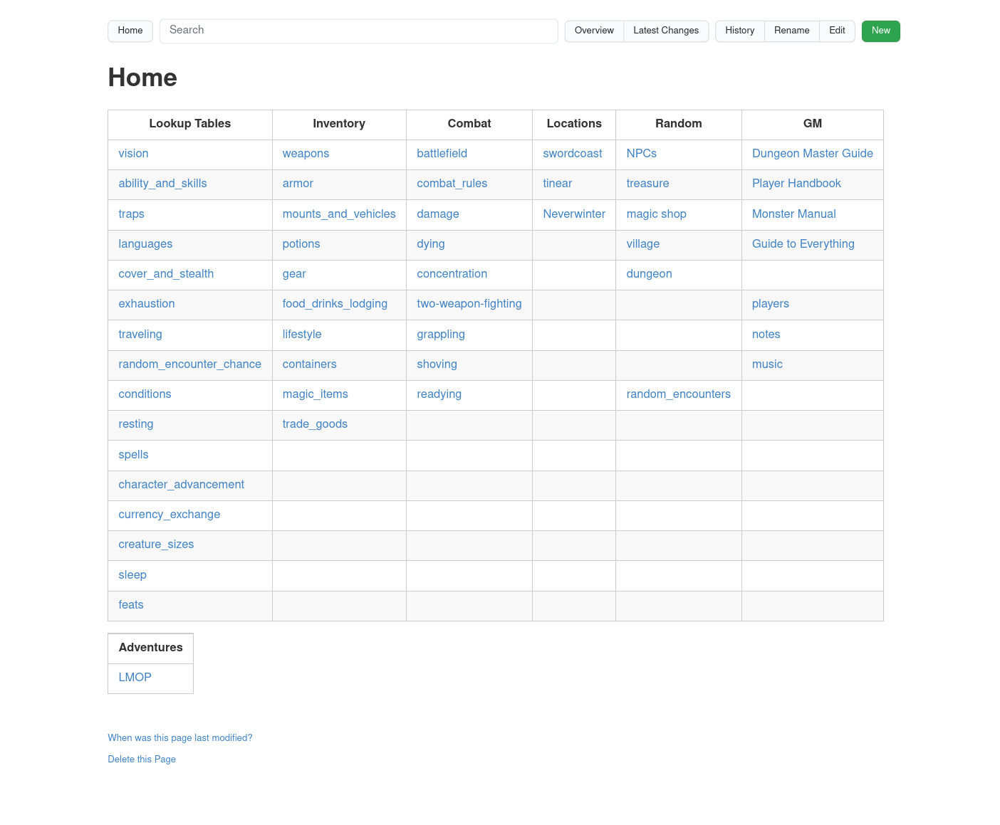

# Introduction

Disclaimer: For my personal usage. I dont take credit to have created all content but more put together what works for me. Feel free to use as a starting point for your ultimate DM setup.

Everydaydm make use of [gollum wiki](https://github.com/gollum/gollum) a simple wiki system built on top of git.

# Usage

1. Install gollum
2. `cd everydaydm;gollum .`
3. then browse to http://localhost:4567
